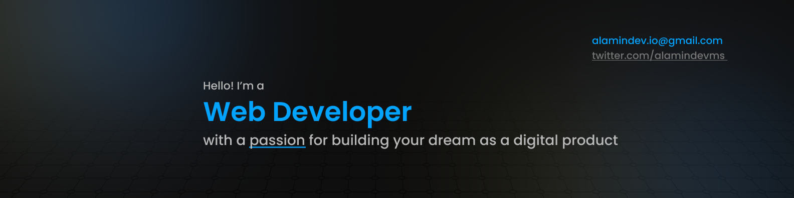

  

<h3>ABOUT ME</h3>
I'm a frontend developer passionate about crafting user-friendly web interfaces. With a keen eye for design and a knack for turning ideas into responsive, elegant websites, I thrive on delivering seamless digital experiences.

<h3>EXPERIENCE</h3>

I've experience working in a private company and as a freelancer.

I've spent most of my time as a developer with the following stacks:

-    
-    

In general terms, proficient in the Vue and React ecosystems. Skilled in TypeScript and committed to writing clean, maintainable code for scalable solutions.

<h3>Technologies</h3>

  

 
